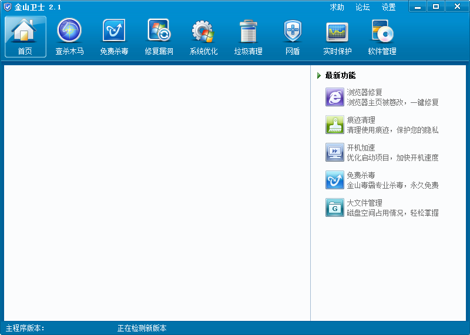

###bkuilib - 金山开源界面库KUI的精简版本

by [cntrump](https://bitbucket.org/cntrump/ok.bkuilib/downloads/)

基于wtl的directUI库。

####说明

稍微看了下源码，添加完整的编译环境。

Demo例子SkinTest例子添加控件ID的事件调用方式。
使得窗口可以最小，最大和关闭。

暂时还未了解其它功能的使用。

